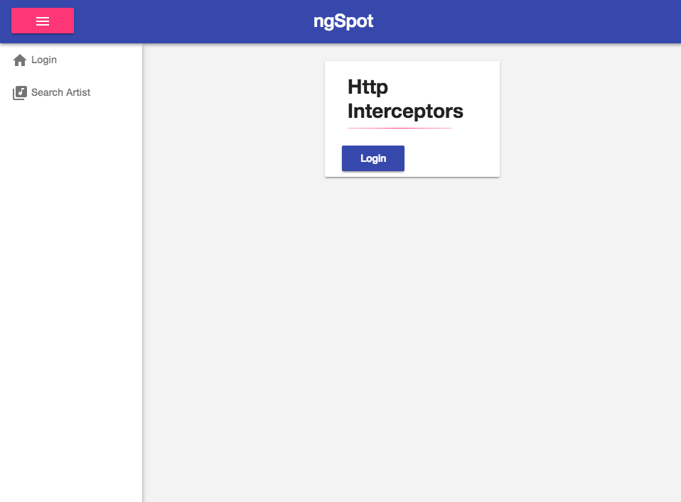

# Angular Http Interceptors



## Prerequisites

 * [Git](https://git-scm.com/book/en/v2/Getting-Started-Installing-Git)
 * Node.js v10.5+ and NPM v6.x – we recommend using [NVM (Linux/Mac)](https://github.com/creationix/nvm) or [NVM-Windows (Windows)](https://github.com/coreybutler/nvm-windows)

## Getting Started

```terminal
git clone https://github.com/onehungrymind/angular-http-interceptors.git
cd angular-http-interceptors
npm install
npm start
```

Navigate to [localhost:4200](http://localhost:4200) in your favorite browser.

> Note: the above terminal commands are for Mac. Remember to substitute the appropriate commands for your OS.

This project was generated with [Angular CLI](https://github.com/angular/angular-cli) version 6.0.8.

## Development server

Run `ng serve` for a dev server. Navigate to `http://localhost:4200/`. The app will automatically reload if you change any of the source files.

## Code scaffolding

Run `ng generate component component-name` to generate a new component. You can also use `ng generate directive|pipe|service|class|guard|interface|enum|module`.

## Build

Run `ng build` to build the project. The build artifacts will be stored in the `dist/` directory. Use the `--prod` flag for a production build.

## Running unit tests

Run `ng test` to execute the unit tests via [Karma](https://karma-runner.github.io).

## Running end-to-end tests

Run `ng e2e` to execute the end-to-end tests via [Protractor](http://www.protractortest.org/).

## Further help

To get more help on the Angular CLI use `ng help` or go check out the [Angular CLI README](https://github.com/angular/angular-cli/blob/master/README.md).
